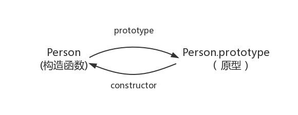

# 原型和原型链

原型和原型链是 `JavaScript` 中非常重要的概念，其对于理解 `JavaScript` 的对象模型和继承非常重要。通过原型和原型链，我们可以实现基于原型的继承、寄生式继承、组合式继承等多种继承方式，从而使代码更加简洁、易读、易于维护。

## 构造函数与实例

使用 `new` 运算符与构造函数是常用的创建对象的方式之一。构造函数是一种特殊的函数，用于创建新的对象实例，当我们使用 `new` 运算符调用一个函数时，它就成为了构造函数，因为它被用来构造一个新的对象实例

```js
// 构造函数
function Person(name) {
  this.name = name
}

// 对象实例
const person1 = new Person('zhangsan')
console.log(person1) // Person {name: 'zhangsan'}
```

::: tip 构造函数的特征

1. 函数名通常以大写字母开头，以便将其与普通函数区分开来（本质上没有任何区别）
   1. **使用 `new` 运算符生成实例的函数就是构造函数**
   2. **直接调用的函数就是普通函数**
2. 构造函数中通常使用 `this` 关键字来指代将要创建的对象实例
3. 构造函数中通常使用属性或方法来定义新对象实例的状态和行为

:::

## `prototype`

在 `JavaScript` 中，每个函数都有一个原型属性 `prototype`，其指向**调用该构造函数而创建的实例的原型**（原型可以是 `null` 或其他对象）


在原型对象（`prototype`）上定义的属性和方法会被对象实例共享

```js
function Person() {}

Person.prototype.name = 'zhangsan'

// 对象实例 person1
const person1 = new Person()
// 对象实例 person2
const person2 = new Person()

console.log(person1.name, person2.name) // 'zhangsan' 'zhangsan'
```

## `constructor`

每一个原型对象 `prototype` 都有一个 `constructor` 属性，其**指向原型的构造函数**

```js
function Person() {}
Person.prototype // { constructor: ƒ Person(name) }

Person.prototype.constructor === Person // true
```



## `__proto__`

在 `JavaScript` 中，每个对象都有一个 `__proto__` 属性，其**指向创建该对象的函数的 `prototype`**，即**构造函数的原型**（也称其为隐私原型）

::: warning `__proto__` 注意点

`__proto__` 用来读取或设置当前对象的原型对象，其本质上是一个内部属性，不是一个正式的对外的 `API`，只是由于浏览器广泛支持，才被加入了 `ES6` 以确保 `Web` 浏览器的兼容性，同时该属性已不推荐使用，在实际开发中更推荐使用 ES6 提供的 `JavaScript`

- 读取当前对象的原型对象
  - [Object.getPrototypeOf](https://developer.mozilla.org/zh-CN/docs/Web/JavaScript/Reference/Global_Objects/Object/getPrototypeOf)
  - [Reflect.getPrototypeOf](https://developer.mozilla.org/zh-CN/docs/Web/JavaScript/Reference/Global_Objects/Reflect/getPrototypeOf)
- 设置当前对象的原型对象
  - [Object.setPrototypeOf](https://developer.mozilla.org/zh-CN/docs/Web/JavaScript/Reference/Global_Objects/Object/setPrototypeOf)
  - [Reflect.setPrototypeOf](https://developer.mozilla.org/zh-CN/docs/Web/JavaScript/Reference/Global_Objects/Reflect/setPrototypeOf)

:::

```js
// 构造函数
function Person(name) {
  this.name = name
}

// 对象实例
const person = new Person('zhangsan')

person.__proto__ === Person.prototype // true
Object.getPrototypeOf(person) === Person.prototype // true
Reflect.getPrototypeOf(person) === Person.prototype // true
```


## 原型链

每个对象都拥有一个原型对象，通过 `__proto__` 指针指向上一个原型 ，并从中继承方法和属性，同时原型对象也可能拥有原型，这样一层一层，最终指向 `null`。这个**链式结构**被称为**原型链**。


::: tip `Object.prototype.__proto__ === null`
`Object.prototype` 是 `JavaScript` 中所有对象的原型。其定义了所有 `JavaScript` 对象都可以使用的属性和方法，例如 `toString()` `hasOwnProperty()` 等<br />
同时 `Object.prototype` 自身也是一个对象，因此它也有一个原型，而该原型是 `null`，这是 `JavaScript` 原型链的顶部。因此 `Object.prototype.__proto__ === null`（为了让原型链有终点）
:::

通过原型链一个对象会拥有定义在其他对象中的属性和方法，从而使得对象之间可以共享属性和方法，从而避免重复代码的出现。

所以当我们尝试访问一个对象的属性时，`JavaScript` 首先在对象本身中查找该属性。如果它没有找到该属性，它会继续在对象的原型中查找，然后在原型的原型中查找，以此类推，直到找到该属性或原型链的顶部

## `Object` 和 `Function`

> 都是给自己看的结论和总结

### 引用类型都是对象

在 `JavaScript` 中**一切引用类型都是对象（函数是一种函数对象）**，对象是属性的集合

> 即引用类型都是 `Object` 的子类

```js
/* 为对象定义属性 */
const obj = { a: 'obj' }

/* 为数组定义属性 */
const arr = []
arr.a = 'arr' // 'arr'

/* 为函数定义属性 */
const fn = function () {}
fn.a = 'fn' // 'fn'
```

### `Function`

`ECMAScript` 上的定义（[15.3.3](http://www.ecma-international.org/ecma-262/5.1/#sec-15.3.3)）

> The Function constructor is itself a Function object and its [[Class]] is "Function". The value of the [[Prototype]] internal property of the Function constructor is the standard built-in Function prototype object.

`Function` 构造函数是一个函数对象，其 `[[Class]]` 属性是 `Function`。`Function` 的 `[[Prototype]]`（即`__proto__`）属性指向了 `Function.prototype`

::: tip `Function.prototype` 注意点

`Function.prototype` 是一个函数，但其没有 `prototype`，同时 `Function.prototype.bind()` 方法创建的函数对象也没有 `prototype`

```js
typeof Function.prototype // 'function'

const fn = Function.prototype.bind()
// ƒ () { [native code] }

fn.prototype // undefined
```

`Function.prototype` 是引擎创建出来的函数，引擎认为不需要给这个函数对象添加 `prototype` 属性，不然 `Function.prototype.prototype` 将无休无止并且没有存在的意义

:::

同时每个 `JavaScript` 函数实际上都是一个 `Function` 对象，即 `Function` 的实例

所以会有这些奇怪的现象

```js
Function instanceof Object // true
// 实际如下
Object.__proto__ === Function.prototype // true

Object instanceof Function // true
// 实际如下
Function.__proto__.__proto__ === Object.prototype // true

Function instanceof Function // true
// 实际如下
Function.__proto__ === Function.prototype // true
```

> 经典图


## 总结

- 所有的引用类型（数组、对象、函数）都是对象（对象是属性的集合）
- 所有的函数都是 `Function` 的实例
- `Object.prototype` 和 `Function.prototype` 均由引擎根据 `ECMAScript` 规范创建的两个特殊对象
- 所有的函数都有一个 `prototype` 属性（原型）指向调用该构造函数而创建的实例的原型
- 所有的对象都有一个 `__proto__` 属性（隐式原型）指向创建该对象的函数的 `prototype`（实例的隐式原型 === 构造函数的原型）
- 每个对象都拥有一个原型对象，通过 `__proto__` 指针指向上一个原型 ，同时原型对象也可能拥有原型，这样一层一层，最终指向 `null`。这个**链式结构**被称为**原型链**

## 相关文章

- [深入理解 javascript 原型和闭包](https://www.cnblogs.com/wangfupeng1988/p/3977924.html)
- [Javascript Object Hierarchy](http://www.mollypages.org/tutorials/js.mp)
- [JavaScript 世界万物诞生记](https://zhuanlan.zhihu.com/p/356980105)
- [从探究 `Function.__proto__ === Function.prototype` 过程中的一些收获](https://github.com/jawil/blog/issues/13)
- [深入探究 Function & Object 鸡蛋问题](https://github.com/yygmind/blog/issues/35)
